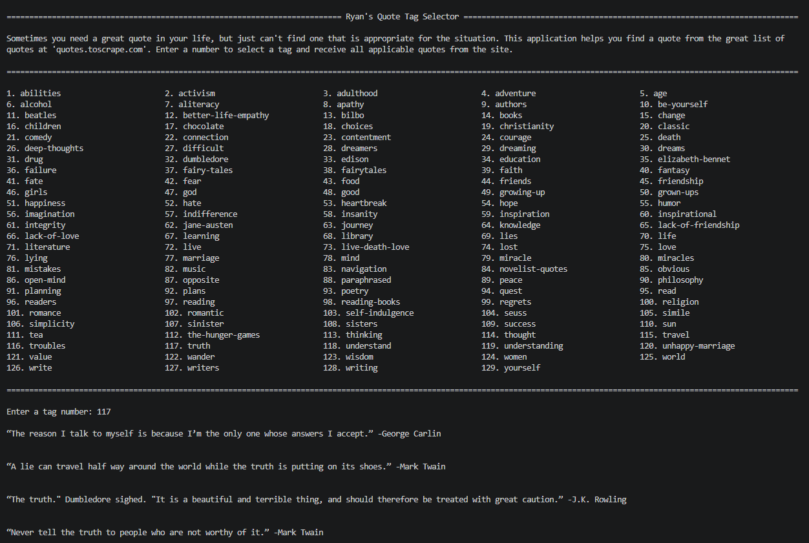
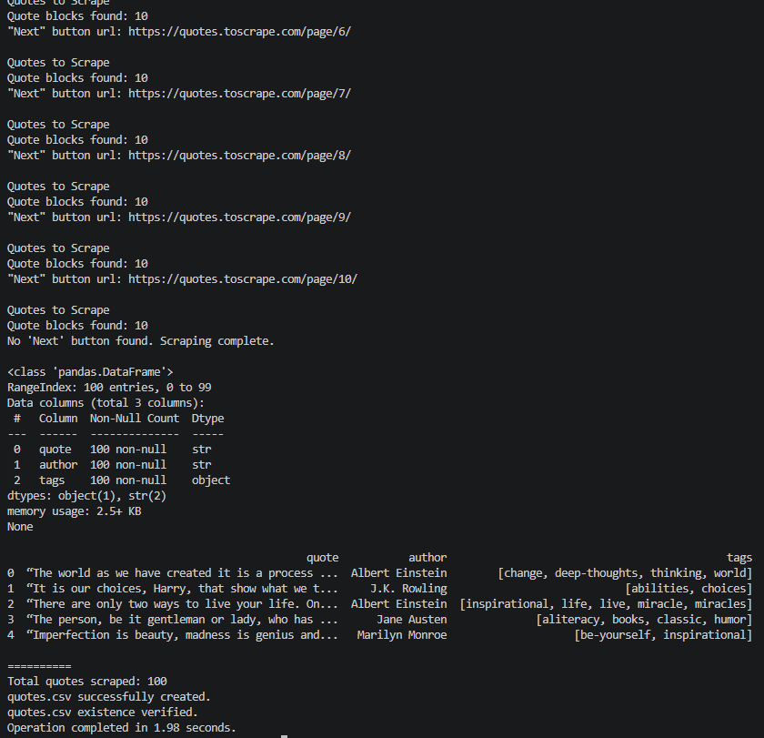
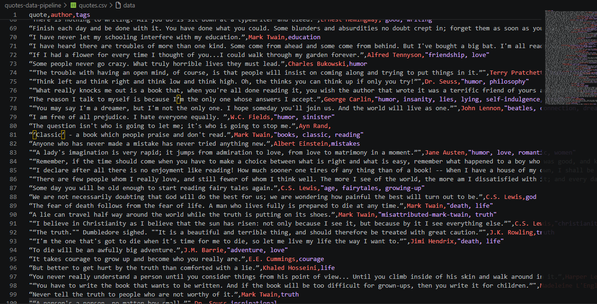

# Quotes Data Pipeline

A lightweight Python data pipeline that scrapes quote data from a website, exports it to CSV, and provides an interactive terminal application for browsing quotes by tag.

This project demonstrates practical Python automation skills including:
- Web scraping
- Data extraction and transformation
- CSV export
- pandas data processing
- Interactive terminal interfaces
- Workflow automation

---

# Features

## Web Scraper
- Scrapes quotes, authors, and tags from multiple pages
- Automatically follows pagination
- Extracts structured quote data
- Exports results to CSV
- Displays runtime and verification information

## Interactive Quote Browser
- Loads CSV datasets using pandas
- Organizes quote tags into a clean multi-column layout
- Allows users to browse quotes by selected tag
- Displays formatted quote results in the terminal
- Handles tag filtering and data transformation

---

# Technologies Used

- Python
- requests
- BeautifulSoup4
- pandas
- CSV
- Terminal/CLI applications

---

# Project Workflow

1. Scrape quote data from the source website
2. Export structured data into CSV format
3. Load CSV data into pandas
4. Filter and browse quotes interactively by tag

---

# Screenshots

## Interactive Quote Browser



---

## Scraper Runtime Output



---

## Generated CSV Dataset



---

# Installation

Clone the repository:

```bash
git clone https://github.com/YOURUSERNAME/quotes-data-pipeline.git
cd quotes-data-pipeline
```

Create and activate a virtual environment:

```bash
python -m venv .venv

# Windows PowerShell
.venv/Scripts/Activate.ps1

# Linux/macOS
source .venv/bin/activate
```

Install dependencies:

```bash
pip install -r requirements.txt
```

---

# Usage

Run the scraper:

```bash
python scraper.py
```

Run the interactive browser:

```bash
python browser.py
```

---

# Output

The scraper generates:

```text
quotes.csv
```

containing:
- Quote text
- Author
- Associated tags

The browser application then loads the CSV dataset and allows interactive exploration by tag.

---

# Purpose

This project was built to practice and demonstrate:
- Real-world data collection workflows
- Python automation
- Structured data handling
- Terminal application design
- Modular project organization
- Reproducible Python environments with virtual environments and dependency management